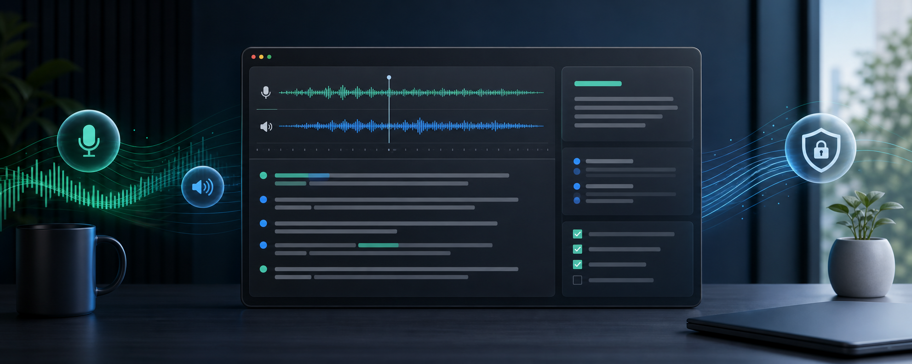

# ClawScribe



ClawScribe is a local-first Windows desktop companion for meetings, calls,
interviews, and recorded audio. It captures microphone and system audio from
your own session, transcribes speech locally, and turns transcripts into
reviewable meeting notes and action items. No meeting bot is required.

Source version: **0.5.36**. See [Windows releases](https://github.com/ch3573r/ClawScribe/releases)
for available installers and their publication status. A source-version bump
or a green helper-test run does not mean an installer has been published.

ClawScribe is based on Meetily Community Edition **0.4.0**. Attribution and
license details are in [UPSTREAM.md](UPSTREAM.md), [NOTICE.md](NOTICE.md),
and [LICENSE.md](LICENSE.md).

## Install And Start A Meeting

Use the NSIS setup installer from the selected GitHub Release; an MSI is also
provided for deployment scenarios. Read that release's validation and signing
notes before installing. Draft builds are unpublished, and prereleases do not
advance the stable automatic-update channel.

Choose a microphone and the output device used by Teams, Webex, or the other
meeting application. Make a short test recording and verify that both your
voice and the remote participants are audible in playback. Start recording,
review the live transcript, then stop and allow queued transcription to finish
before generating notes. Automatic meeting detection is a separate Teams
feature; general system-audio capture does not require it.

Review names, numbers, decisions, owners, and deadlines before sharing notes or
exporting tasks. Obtain the recording permissions required for your meeting.

## Capture And Transcription

- Microphone and system-audio capture from the local Windows session.
- Live transcription, audio/video import, and retranscription with a different
  model or language selection.
- Import support for MP4, M4A, WAV, MP3, FLAC, OGG, AAC, MKV, WebM, and WMA.
- Disk-backed live recognition queue and interrupted-recording recovery paths.
- Timestamp playback controls, speaker-label editing, and a **Jump to live
  transcript** control when reading earlier text during a recording.

| Engine | Role |
| --- | --- |
| Parakeet | Default local fast path, with stock v3 int8, SmoothQuant int8, and v2 int8 options. Supported GPU builds can use DirectML. |
| Whisper | Local whisper.cpp/whisper-rs engine with selectable models and Vulkan support in the Windows GPU build. |
| Nemotron | Beta multilingual Nemotron 3.5 ASR path. fp16 is CPU-capable; int8 is intended for DirectML-capable builds. |
| Hosted Whisper | Opt-in beta cloud retranscription through OpenAI-compatible file transcription. |
| MAI-Transcribe | Opt-in beta Azure Speech Fast Transcription, using credentials separate from Microsoft Graph sign-in. |

Models are downloaded in the app. Downloads are checked against expected file
sizes to reject incomplete downloads and LFS pointer files.

Cloud transcription requires explicit opt-in. Hosted Whisper can provide word
timestamps; MAI has sentence-level timing and may use approximate local VAD-row
alignment, not fabricated word timestamps. The implemented OpenAI-hosted upload
limit is 25 MB; the implemented MAI limit is 300 MB. MAI uploads use WAV, MP3, or
FLAC, with other formats converted locally to 16 kHz mono WAV. Rejected cloud
requests can fall back to local transcription with a notification explaining
why. See [hosted transcription verification](docs/hosted-transcription-smoke.md).

## Meeting Notes And Exports

Generate template-based meeting summaries from the transcript and optional
context, regenerate notes, and chat about the selected meeting. Configurable
providers include Built-in AI, Ollama, OpenAI, OpenAI-compatible endpoints,
OpenRouter, Anthropic/Claude, Groq, OpenClaw managed processing, and the advanced
bundled Codex app-server path.

Microsoft sign-in supports calendar context and exports. Teams detection can
prompt or auto-start recording according to your setting. Invited attendees
can be included as a reviewable attendance checklist; an invitation does not
prove attendance.

- **OneNote:** choose or create a notebook and export notes/transcripts into a
  fresh dated section, avoiding large-library section-listing problems.
- **Planner and Microsoft To Do:** review and edit action items before exporting;
  a local ledger protects supported re-export paths against duplicates.
- **Confluence:** copy rich text into a browser draft, or publish through a
  configured self-hosted Server/Data Center REST endpoint.
- **OpenClaw:** optional handoff of completed Meetily-compatible recording folders.

OpenClaw is optional. A standalone installation does not require an OpenClaw
endpoint, token, or separate server.

## What Changed In 0.5.36

This version fixes skipped source text at shared-summary chunk boundaries,
preserves meaningful multilingual words in the transcript view, improves live
scrolling and speaker-save feedback, and limits diagnostic logging overhead.
Windows Whisper uses measured physical RAM and a more conservative thread
budget on low-memory machines. Previously unreleased fixes protect the Windows
Microsoft-token fallback with DPAPI and stop a transcript-length heuristic from
discarding short utterances.

These are implementation changes, not a guarantee of error-free recognition,
hallucination-free notes, or real-time performance on every notebook. See the
[0.5.36 release notes](docs/releases/0.5.36.md),
[meeting-quality guide](docs/meeting-quality.md), and [changelog](CHANGELOG.md).

## Notebook Performance And Product Status

Windows is the primary release target; the supported runtime is the Tauri
desktop app. macOS/Linux source paths are not a claim of equivalent release
validation. Nemotron and cloud transcription remain beta.

On Windows, Whisper's adaptive policy caps inference at four threads when the
detected memory value is at most 8 GiB, and at eight otherwise. Where possible
it leaves one logical thread outside that limit. This is a Whisper policy,
not a process-wide CPU or RAM cap, and does not automatically govern Parakeet,
Nemotron, or a summary provider. A valid `MEMORY_GB` environment override is
retained for diagnostics.

Performance depends on the selected model, audio, available memory, GPU/driver,
and the concurrent meeting application. The i5-1235U/8 GB target has not been
certified by the source tests. Do not interpret queued transcription as lost
audio or claim it is live when processing is still catching up.

## Privacy And Credentials

Recording and transcription remain local unless you explicitly enable cloud
transcription or configure external summary/export processing. Data sent to an
external provider is subject to that provider's configuration and policies.

Microsoft refresh tokens use the platform credential store when possible. On
Windows, the file fallback is DPAPI-encrypted for the current user; legacy
plaintext fallback files migrate on successful read. Non-Windows platforms do
not write a plaintext fallback. Access tokens are not persisted by this token
store. This protects that credential path; it does **not** mean all recordings,
transcripts, or the meeting database are encrypted at rest.

Never commit credentials, `.env` files, private logs, recordings, databases,
generated installers, or personal workspace paths. Use explicit placeholders
in examples and keep diagnostics redacted. Contributor guidance is in
[CLAUDE.md](CLAUDE.md) and [CONTRIBUTING.md](CONTRIBUTING.md).

## Development

Use Node.js 24, pnpm 10, and the native prerequisites in
[Building ClawScribe](docs/BUILDING.md). From `frontend/`:

```powershell
pnpm install --frozen-lockfile
pnpm run tauri:dev
```

For the web UI only, use `pnpm run dev`. It is not a replacement for native
recording tests. Run frontend checks with `pnpm typecheck` and `pnpm test`.
Windows packaging and required sidecar staging are documented in
[Windows releases](docs/windows-release.md).

```text
frontend/src/             React UI, hooks, services, and routes
frontend/src-tauri/src/   Rust/Tauri audio, transcription, summary, and exports
llama-helper/             Local summary sidecar
scripts/                  Repository utilities
docs/                     Product and build documentation
```

The historical Python/FastAPI service has been removed; no standalone service,
Docker component, or manually started whisper-server is needed for local use.

## Documentation And Support

- [Documentation index](docs/README.md)
- [Building from source](docs/BUILDING.md)
- [Windows release and verification](docs/windows-release.md)
- [GPU acceleration](docs/GPU_ACCELERATION.md)
- [Frontend developer guide](frontend/README.md)

[Support development](https://buymeacoffee.com/ch3573r).

## License

ClawScribe is free to use, modify, and redistribute under the
[MIT License](LICENSE.md). Upstream Meetily code is copyright Zackriya Solutions
and contributors. ClawScribe changes are copyright OpenClaw contributors unless
otherwise noted.
