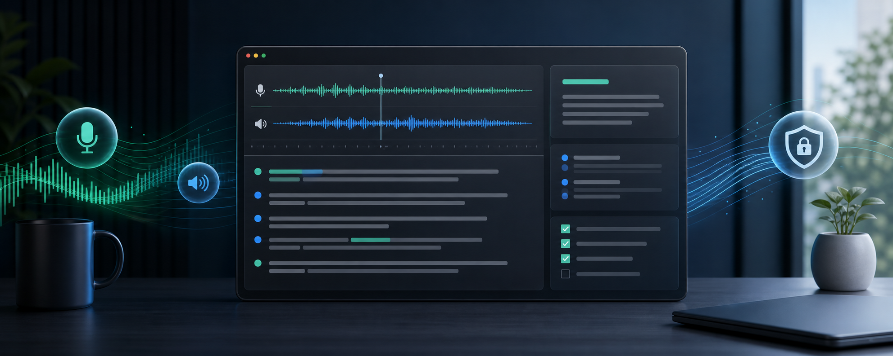

# ClawScribe



ClawScribe is a local-first Windows desktop companion for meetings, calls,
interviews, and recorded audio. It captures microphone and system audio from
your own session, transcribes speech locally, and turns transcripts into
reviewable meeting notes and action items. No meeting bot is required.

Source version: **0.5.52**. This Windows GPU preview applies shared controls,
sentence-case labels and semantic theme colors across Settings, Home and
recording, Meeting details, Onboarding, import and backup screens. Existing
meeting-memory search and cited conversations remain available. See the
[0.5.52 preview notes](docs/releases/0.5.52.md) and the
[latest stable release](https://github.com/ch3573r/ClawScribe/releases/latest).
Stable remains **0.5.48**. Enable **Include prereleases** to discover published
previews; drafts are excluded from updates. Installed acceptance remains
pending for this preview; stable promotion follows real-device acceptance.

ClawScribe is based on Meetily Community Edition **0.4.0**. Attribution and
license details are in [UPSTREAM.md](UPSTREAM.md), [NOTICE.md](NOTICE.md),
and [LICENSE.md](LICENSE.md).

## Install And Start A Meeting

Use the NSIS setup installer from the selected GitHub Release; an MSI is also
provided for deployment scenarios. Read that release's validation and signing
notes before installing. Draft builds are unpublished, and prereleases do not
advance the stable automatic-update channel.

The Windows GPU build needs the Vulkan loader (`vulkan-1.dll`) at startup, even
when selecting a non-Vulkan model. Use a supported GPU driver or the official
Vulkan runtime. The CI runtime fix does not install a driver or runtime on your
PC. See [Windows runtime prerequisites](docs/windows-release.md#windows-runtime-prerequisite)
for diagnosis; never download individual DLLs from third-party sites.

Choose a microphone and the output device used by Teams, Webex, or the other
meeting application. Make a short test recording and verify that both your
voice and the remote participants are audible in playback. Start recording,
review the live transcript, then stop and allow queued transcription to finish
before generating notes. Automatic meeting detection is a separate Teams
feature; general system-audio capture does not require it.

**Test mic** in Recording settings shows the microphone actually tested. If a
preferred Windows microphone is unavailable, the test identifies its fallback
to the current default. A system-audio silence warning clears when sound later
arrives; verify both sources in saved playback before relying on the recording.

Review names, numbers, decisions, owners, and deadlines before sharing notes or
exporting tasks. Obtain the recording permissions required for your meeting.

## Capture And Transcription

- Microphone and system-audio capture from the local Windows session.
- Live transcription, audio/video import, and retranscription with a different
  model or language selection.
- **Record now, transcribe later:** choose audio-only mode on Home or in
  Recording settings. It always saves audio, skips the speech model and live
  transcription, and leaves a **Transcribe** action on the saved meeting.
- Recording continues after temporary queue pressure or spool-write failures,
  with incomplete audio reported visibly. Playback streams saved recordings.
  Stop saves available audio even if transcript backup writes fail, and capture
  gaps are reported separately from save failures. Repeated Stop actions reuse
  the same library meeting. Recovery originals use about 700 MB per hour while recording; choose a local
  folder with enough space. See [recording and recovery](docs/meeting-quality.md).
- Correct transcript passages or preview literal find-and-replace across the
  entire meeting. Original recognition and segment timing are retained; undo
  restores previous corrections. Regenerate notes after correcting a transcript.
- **Restore previous transcript** after retranscription or speaker detection.
- Detect speakers in a saved recording and cancel from the dialog or meeting
  toolbar. Cancellation waits for the current native step before another recording
  can start.
- Import support for MP4, M4A, WAV, MP3, FLAC, OGG, AAC, MKV, WebM, and WMA.
- HE-AAC imports use the decoder's actual sample rate to preserve timing.
- Interrupted Whisper and Parakeet downloads retain partial files for retry;
  cancellation finishes the active transfer before another attempt can start.
- Disk-backed live recognition queue and interrupted-recording recovery paths.
- Timestamp playback controls, speaker-label editing, and a **Jump to live
  transcript** control when reading earlier text during a recording.

| Engine | Role |
| --- | --- |
| Parakeet | Default local fast path, with stock v3 int8, SmoothQuant int8, and v2 int8 options. Supported GPU builds can use DirectML. |
| Whisper | Local whisper.cpp/whisper-rs engine with selectable models and Vulkan support in the Windows GPU build. |
| Nemotron | Beta multilingual Nemotron 3.5 ASR path. fp16 is CPU-capable; int8 is intended for DirectML-capable builds. |
| Hosted Whisper | Import and Enhance only (beta), through an opt-in OpenAI-compatible file-transcription API. |
| MAI-Transcribe | Import and Enhance only (beta), through opt-in Azure Speech Fast Transcription; credentials are separate from Microsoft Graph sign-in. |

Speech, speaker-detection, and Built-in AI summary models downloaded in the app
are pinned to specific revisions and SHA-256-verified before use. Damaged or
incomplete files require re-download; unchanged verified files reuse their
integrity checks.

Whisper preserves recognized repetitions and short answers instead of removing
them through phrase matching. Nemotron's **Auto** language follows the system
locale; select the spoken language explicitly when it differs. Parakeet's Auto
selection does not label an unknown language as English.

Cloud transcription requires explicit opt-in. Saved cloud settings remain visible
when the opt-in is off. Settings explain which local engine and model live
recordings use. Cloud APIs apply to Import and Enhance (whole-file), while live
recordings stay on-device.
Hosted Whisper can provide word timestamps; MAI has sentence-level timing and
may use approximate local VAD-row alignment, not fabricated word timestamps.
The implemented OpenAI-hosted upload limit is 25 MB; the implemented MAI limit
is 300 MB. MAI uploads use WAV, MP3, or
FLAC, with other formats converted locally to 16 kHz mono WAV. Rejected cloud
requests can fall back to local transcription with a notification explaining
why. See [hosted transcription verification](docs/hosted-transcription-smoke.md).

## Meeting Notes And Exports

The meeting-memory preview in this source branch adds **Meetings → Meeting
memory** in a separate tab: use the searchable picker to select saved meetings
explicitly, or choose all saved meetings, then
search transcript passages and ask cited questions. Project Any/All/Untagged
filters and inclusive dates constrain that same selection. Keyword retrieval
works without downloading a model; optional local semantic retrieval uses the
embedding model under **Settings → Meeting memory**. Results show the mode
actually used, and answers show the configured and executed summary provider.
The first question starts a saved conversation automatically. Model settings
show download bytes and integrity verification separately from indexing. The
pinned multilingual E5 model and tokenizer use ONNX Runtime locally on CPU;
healthy files can be verified without downloading them again.
Open citations to inspect evidence, reveal its current transcript position, or
play saved audio at a verified recording offset. Historical, changed, missing,
and invalid sources remain explicitly identified and cannot navigate as current
evidence. Existing meeting chat is preserved and defaults to this meeting only.
Expanding to other meetings uses a separate saved library conversation; switching
back restores the meeting's history.
Saved meetings also accept PDF, DOCX, TXT and Markdown reference documents.
Attach and preview them locally, then explicitly select which references a
question may use. Citations open the extracted page or paragraph, keeping
reference material distinct from the recorded discussion. Sending excerpts to
an external answer provider requires **Allow reference sharing** for that
conversation, off by default. Live assistance is the next planned phase. Installed offline, provider-failure, focus, citation,
and playback acceptance remains pending; see the
[local library guide](docs/local-library.md#meeting-memory) and
[preview acceptance policy](docs/windows-release.md#required-real-device-acceptance).

- **Local Word export:** save a summary, full transcript, or both as `.docx`,
  including tables, with optional speaker labels and recording-relative timestamps. Works offline without Microsoft
  sign-in or Word installed.
- **Project tags:** choose existing labels from a searchable list or create new
  ones, then filter the archive and transcript search by one or more projects
  (matching any or all), or show untagged meetings.
- **Meeting bookmarks:** mark a moment while recording, then label and revisit
  it from the saved transcript panel. Add markers during playback too.

Generate template-based meeting summaries from the transcript and optional
context, regenerate notes, and chat about the selected meeting. Per-meeting summary
context is saved in the local library and included in backups. Configurable
providers include Built-in AI, Ollama, OpenAI, OpenAI-compatible endpoints,
OpenRouter, Anthropic/Claude, Groq, OpenClaw managed processing, and the advanced
bundled Codex app-server path.

The advanced Codex provider bundles app-server **0.159.2**, with GPT-6.1 Sol
(`gpt-6.1-sol`) in its model catalog. Choose **Check bundled runtime** in Summary
settings after upgrading to refresh models. Availability depends on the signed-in account and workspace;
your saved model selection is preserved. OpenAI's API model fallback list also
includes GPT-6.1 Sol.

In **Settings → Summary**, create or edit templates and choose a persistent
default. Each meeting can use a different template when generating notes.
Summary find-and-replace preserves formatting and source links; review the
changes, which save automatically. Use the editor's undo command to revert changes.

Meeting titles and summary edits save automatically. Regenerating edited notes
asks for confirmation, and **Restore previous summary** lets you return to the
previous version after a successful generation.

Saving a title leaves unchanged notes alone. Failed saves retain drafts, and
edits made during a save remain available to save again. Switching meetings
discards late loading results from the previous meeting. Automatic summaries
wait for saved notes to load and use the provider you have configured.

New summaries request links to supporting transcript passages. Open a source
link to inspect the text, reveal it in the transcript, or play its saved audio.
Changed or replaced passages are flagged and require regenerated references.
Citation coverage depends on the model; inspect the passage to check the claim.

Microsoft sign-in supports calendar context and exports. Teams detection can
prompt or auto-start recording according to your setting. Invited attendees
can be included as a reviewable attendance checklist; an invitation does not
prove attendance.

- **OneNote:** choose or create a notebook and export notes/transcripts into a
  fresh dated section, avoiding large-library section-listing problems.
- **Planner and Microsoft To Do:** review and edit action items before exporting;
  saved export history protects supported re-export paths against duplicates.
- **Confluence:** copy rich text into a browser draft, or publish through a
  configured self-hosted Server/Data Center REST endpoint.
- **OpenClaw:** optional handoff of completed Meetily-compatible recording folders.

Microsoft exports stop if duplicate-protection history cannot be read or saved.
An interrupted export with an unknown outcome is not automatically repeated;
check the destination before creating another page or task. See
[Microsoft export recovery](docs/integrations/microsoft-graph.md#export-history-and-recovery).

Private-network HTTP for OpenClaw, custom OpenAI endpoints, and Confluence requires
an explicit unencrypted-HTTP opt-in in Settings. Existing private HTTP setups
retain access on upgrade. Tailscale addresses and MagicDNS names are supported.
Public HTTP destinations are rejected on save/send; existing settings remain
editable and explain what needs correction. Confluence remembers its HTTP choice
for the saved server even while that server is offline.

OpenClaw is optional. A standalone installation does not require an OpenClaw
endpoint, token, or separate server.

## Library And Data

**Backup and restore** saves a portable archive of meeting data, summary context,
and recordings. Restore adds missing meetings and skips existing IDs. Backups
continue when recording folders are missing and report affected meetings,
excluded recovery files, and unavailable audio. Archives exclude credentials and
models and are not encrypted.
Saved knowledge conversations, attached reference originals and extracted blocks,
and their original citation labels are included. Reference sharing permissions
are excluded and remain off after restore.
Restored references remain historical until a new question establishes fresh
evidence; interrupted answers are never resubmitted automatically.

Meeting deletion can also remove its recording folder, including audio,
transcript copies, metadata, recovery originals, and generated documents. The
option is on by default; folders outside supported storage locations, shared
with another meeting, or failing ownership checks are kept and reported.
Pre-migration database snapshots and separate backup archives can retain deleted
meetings. See [local library tools](docs/local-library.md#deleting-meetings).

## Update Preferences

ClawScribe checks **stable releases** by default. Enable **Include prereleases**
under **Settings > Preferences > Updates** or **About** to receive preview builds
as well. The choice persists across restarts and applies to manual and startup
checks. You still choose when to install; checking at launch is a separate option.

Preview builds may contain unfinished features. Turning previews off waits for a
newer stable version and never downgrades your installation. Update downloads
retain Tauri signature verification and remain subject to Windows security policy.

## What changed in 0.5.52 preview

- Use shared controls and sentence-case labels across the six UI areas.
- Replace raw status colors, rings and Home overlays with named theme colors.
- Consolidate Tailwind/PostCSS configuration while preserving application fonts,
  sidebar colors, animations and CSS prefixing.
- Reduce all 68 files in the UI conventions baseline to zero recorded violations.
- Provide a preview for installed light/dark, accent, keyboard and narrow-layout
  review. Application behavior, provider and recording logic are unchanged.

See the [preview notes](docs/releases/0.5.52.md), the
[previous meeting-memory preview](docs/releases/0.5.51.md), and the [changelog](CHANGELOG.md).

## Notebook Performance And Product Status

Windows is the primary release target; the supported runtime is the Tauri
desktop app. macOS/Linux source paths are not a claim of equivalent release
validation. Nemotron and cloud transcription remain beta.

On Windows, Whisper's adaptive policy caps inference at four threads when the
detected memory value is at most 8 GiB, and at eight otherwise. Where possible
it leaves one logical thread outside that limit. This is a Whisper policy,
not a process-wide CPU or RAM cap, and does not automatically govern Parakeet,
Nemotron, or a summary provider. A valid `MEMORY_GB` environment override is
retained for diagnostics.

Performance depends on the selected model, audio, available memory, GPU/driver,
and the concurrent meeting application. The i5-1235U/8 GB target has not been
certified by the source tests. Do not interpret queued transcription as lost
audio or claim it is live when processing is still catching up.

## Privacy And Credentials

Recording and transcription remain local unless you explicitly enable cloud
transcription or configure external summary/export processing. Data sent to an
external provider is subject to that provider's configuration and policies.

Provider keys, OpenClaw, and Microsoft refresh tokens use protected OS storage,
with current-user DPAPI fallbacks on Windows. Codex sign-in and Confluence use
the keyring without file fallback. Meeting files and the full database are not
encrypted by this protection; see the [privacy policy](PRIVACY_POLICY.md).

Never commit credentials, `.env` files, private logs, recordings, databases,
generated installers, or personal workspace paths. Use explicit placeholders
in examples and keep diagnostics redacted. Contributor guidance is in
[CLAUDE.md](CLAUDE.md) and [CONTRIBUTING.md](CONTRIBUTING.md).

## Development

Use Node.js 24, pnpm 10, and the native prerequisites in
[Building ClawScribe](docs/BUILDING.md). From `frontend/`:

```powershell
pnpm install --frozen-lockfile
pnpm run tauri:dev
```

For the web UI only, use `pnpm run dev`. It is not a replacement for native
recording tests. Run frontend checks with `pnpm typecheck` and `pnpm test`.
Windows packaging and required sidecar staging are documented in
[Windows releases](docs/windows-release.md).

All CI checks and Windows installers run on the designated local self-hosted
machine, with no GitHub-hosted fallback. Fork PRs require maintainer review and
validation from a trusted repository branch. Test installers and build caches
stay local; GitHub distribution uses explicitly requested draft or published
releases.

```text
frontend/src/             React UI, hooks, services, and routes
frontend/src-tauri/src/   Rust/Tauri audio, transcription, summary, and exports
llama-helper/             Local summary sidecar
scripts/                  Repository utilities
docs/                     Product and build documentation
```

The historical Python/FastAPI service has been removed; no standalone service,
Docker component, or manually started whisper-server is needed for local use.

## Documentation And Support

- [Documentation index](docs/README.md)
- [Building from source](docs/BUILDING.md)
- [Windows release and verification](docs/windows-release.md)
- [GPU acceleration](docs/GPU_ACCELERATION.md)
- [Frontend developer guide](frontend/README.md)

[Support development](https://buymeacoffee.com/ch3573r).

## License

ClawScribe is free to use, modify, and redistribute under the
[MIT License](LICENSE.md). Upstream Meetily code is copyright Zackriya Solutions
and contributors. ClawScribe changes are copyright OpenClaw contributors unless
otherwise noted.
